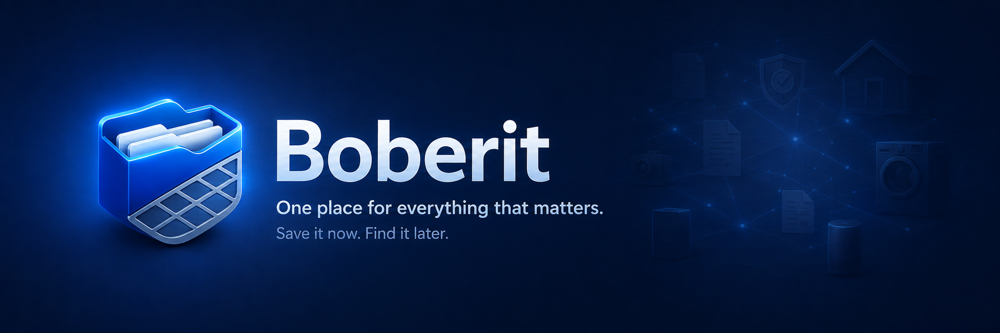

# Boberit

**One place for everything that matters.**  
**Save it now. Find it later.**



Boberit to samodzielnie hostowane domowe archiwum przedmiotów i dokumentów. Łączy dane zakupu, gwarancje, konserwację, załączniki, niezależne dokumenty i lokalne OCR w jednym, zwartym interfejsie dostosowanym do telefonu i komputera.

## Zakres wersji 0.1.0

- Przedmioty z danymi zakupu, gwarancją, tagami, notatkami i załącznikami, które można pobierać oraz pojedynczo usuwać.
- Terminy gwarancji oraz jednorazowa i cykliczna konserwacja z edycją planów, oznaczaniem wykonania i historią czynności.
- Sekcja **Do przypisania** do masowego importu plików i późniejszego przypisania ich do przedmiotów albo dokumentów.
- **Dokumenty** prezentowane w zwartej tabeli, ze szczegółami załączników, ich podglądem, pobieraniem i usuwaniem.
- Lokalne OCR PL/ENG dla obrazów i PDF, status każdego dokumentu, ponowne rozpoznawanie, korekta tekstu oraz zbiorcze OCR zaległych dokumentów.
- Wspólne wyszukiwanie przedmiotów, metadanych dokumentów, tagów i rozpoznanej treści OCR.
- Start z liczbą przedmiotów, dokumentów i wykorzystanym miejscem aktywnego gospodarstwa oraz zestawieniem terminów wymagających uwagi.
- Centrum powiadomień z dzisiejszymi terminami i historią działań UI; krótkie komunikaty operacji znikają automatycznie.
- Kosz z 30-dniowym okresem przywracania przedmiotów i dokumentów.
- Lokalne konta, wiele gospodarstw, role właściciel/członek oraz przełączanie aktywnego gospodarstwa.
- Backup i odtwarzanie aktywnego gospodarstwa oraz historia jego aktywności i wykorzystania miejsca.
- Edytowalne webhooki z oddzielną konfiguracją zakresu zdarzeń i gospodarstw.
- Responsywna, instalowalna PWA z szybkim dodawaniem zdjęć, plików, przedmiotów i dokumentów.

Szczegółowy stan znajduje się w [dokumencie wdrożenia](docs/IMPLEMENTATION.md), a decyzje produktowe w [blueprincie](docs/PRODUCT_BLUEPRINT.md).

## Uruchomienie

Wymagane są Docker z Compose oraz 64-znakowy klucz `APP_ENC_KEY`. Klucz chroni sekrety webhooków zapisane w bazie, nie trafia do backupu i powinien pozostać niezmienny dla danej instalacji.

```bash
cp .env.example .env
printf 'APP_ENC_KEY=%s\n' "$(openssl rand -hex 32)" > .env
docker compose up --build -d
```

Aplikacja jest domyślnie dostępna pod `http://localhost:3219`. Przy pierwszym uruchomieniu tworzy się konto właściciela i pierwsze gospodarstwo.

Plik `.env` jest ignorowany przez Git. Zachowaj jego bezpieczną kopię niezależnie od backupu Boberit. Utrata lub zmiana klucza uniemożliwi odszyfrowanie zapisanych sekretów webhooków.

## Dane i aktualizacja

Baza SQLite i załączniki znajdują się w nazwanym wolumenie `boberit-data`, który pozostaje zachowany po `docker compose down`. Nie używaj `docker compose down -v`, jeśli chcesz zachować dane. Przed aktualizacją pobierz także pakiet w **Ustawienia → Backup**.

Wewnątrz `/data` baza znajduje się w `db`, a pliki w `items/<household_id>`, `documents/<household_id>` oraz `inbox/<household_id>`. Przy aktualizacji starszy układ jest migrowany automatycznie.

Przy użyciu katalogu hosta zamiast nazwanego wolumenu ustaw `PUID` i `PGID` na identyfikatory właściciela katalogu:

```bash
printf 'PUID=%s\nPGID=%s\n' "$(id -u)" "$(id -g)" >> .env
sudo chown -R "$(id -u):$(id -g)" /wlasciwa/sciezka/data
```

Druga komenda jest potrzebna tylko raz dla już istniejącego katalogu z innym właścicielem. Zastąp przykładową ścieżkę rzeczywistą ścieżką bind mountu.

```bash
docker compose build
docker compose up -d
```

## Publikowanie wydań

Obrazy kontenerowe są budowane wyłącznie po opublikowaniu GitHub Release. Zwykłe commity i pushe nie uruchamiają budowania obrazu.

- `main`: release produkcyjny `vX.Y.Z` publikuje tagi `latest` i `vX.Y.Z`.
- `dev`: prerelease `vX.Y.Z-dev.N` publikuje tagi `dev_latest` i `vX.Y.Z-dev.N`.

Obie gałęzie korzystają z oddzielnych workflow i oddzielnych zakresów cache. Szczegółowa procedura oraz wymagane ustawienia GHCR znajdują się w [instrukcji wydań](docs/GITHUB_RELEASES.md).

## Materiały projektu

- [Stan wdrożenia i weryfikacja](docs/IMPLEMENTATION.md)
- [Lista kontrolna wydania 0.1.0](docs/RELEASE_CHECKLIST.md)
- [Koncept produktu i długoterminowy plan](docs/PRODUCT_BLUEPRINT.md)
- [System kolorów](docs/COLOR_SYSTEM.md)
- [Branding](branding/README.md)
- [Historyczny prototyp UI](prototype/index.html)
