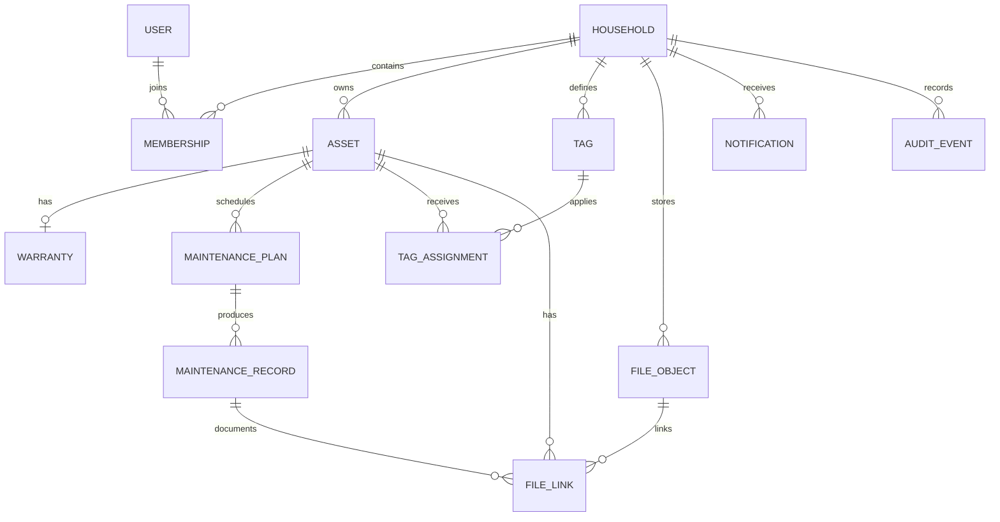
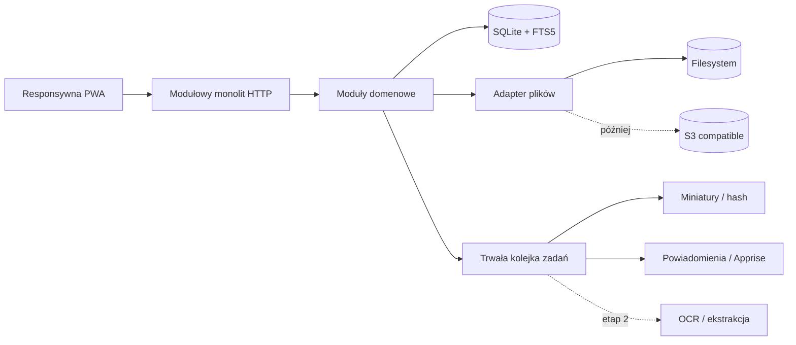

# Boberit — koncept produktu i plan wdrożenia

Status: utrwalony koncept i długoterminowy plan; bieżący stan: kandydat 0.1.0  
Zakres wdrożony: rzeczy domowe, niezależne dokumenty, OCR, konta i gospodarstwa  
Język startowy: polski, architektura gotowa na i18n  
Model dystrybucji: self-hosted, Docker, mobile-first PWA

## 1. Decyzja w skrócie

Boberit powinien powstać jako prosty, modułowy monolit z jednym wspólnym rdzeniem dla rzeczy, plików, tagów, wyszukiwania i przypomnień. Pierwszy kandydat wydania zastępuje kluczowe codzienne użycie DumbAssets i obejmuje lekki Segregator z lokalnym OCR. Nie próbuje kopiować pełnego zakresu rozbudowanego DMS.

Najważniejszym produktem MVP nie jest rozbudowany formularz, lecz niezawodna pętla:

1. Zapisz rzecz lub plik w kilkanaście sekund, szczególnie z telefonu.
2. Uzupełnij szczegóły teraz albo później.
3. Połącz rzecz z paragonem, instrukcją, gwarancją i terminami.
4. Znajdź wszystko jednym wyszukiwaniem bez pamiętania struktury katalogów.
5. Otrzymaj przypomnienie i zapisz wykonanie czynności.

Rekomendowany rdzeń technologiczny to TypeScript, responsywna PWA, API HTTP, SQLite z FTS5 oraz system plików jako domyślny magazyn. Całość działa w jednym kontenerze i na jednym wolumenie. Interfejsy magazynu plików, wyszukiwania i zadań tła należy zaprojektować tak, aby później można było podłączyć S3, osobny worker albo bardziej zaawansowane OCR bez przebudowy domeny.

## 2. Wnioski z analizy projektów referencyjnych

### DumbAssets — co zachować jako inspirację

DumbAssets potwierdza sens małego, samodzielnie hostowanego narzędzia do fizycznych zasobów. Udostępnia informacje o modelu i numerze seryjnym, hierarchię komponentów, zdjęcia i paragony, gwarancje, konserwację, tagi, powiadomienia przez Apprise, bezpośrednie linki i Docker. Jego prostota wdrożenia jest wartością, którą Boberit powinien zachować.

Jednocześnie dane zapisane w plikach JSON, pliki rozdzielone na katalogi według typu oraz prosty frontend i wyszukiwanie ograniczają dalszy rozwój. Boberit powinien od początku mieć transakcyjną bazę, spójny model załączników, indeks pełnotekstowy i kontrakt uploadu odporny na błędy sieci mobilnej.

### Papra — co zachować jako inspirację

Papra trafnie traktuje dokument jako trwały oryginał, którego system nie modyfikuje. Cenne są też: pełnotekstowe wyszukiwanie i filtry, tagi, ekstrakcja treści/OCR, reguły automatyzacji, skrzynki importu, API, webhooki, elastyczny storage oraz dzielenie zasobów.

Boberit przyjmuje zasadę „oryginał jest nienaruszalny”, ale nie przenosi na start całego zakresu DMS. W pierwszym etapie plik jest bezpiecznym załącznikiem rzeczy lub zdarzenia. W drugim staje się również samodzielnym dokumentem. Ten podział chroni MVP przed nadmiernym zakresem.

### Czego świadomie nie kopiować

- wyglądu, układu nawigacji, nazewnictwa i komponentów UI obu aplikacji;
- modelu danych DumbAssets opartego na JSON;
- kompletnego zakresu Papry w pierwszym wydaniu;
- konkretnego kodu lub assetów objętych licencjami GPL/AGPL;
- modalnego formularza z dziesiątkami pól jako jedynej drogi dodania rzeczy.

Inspirujemy się problemami i wzorcami domenowymi. Implementacja, design system i architektura Boberit pozostają autorskie.

## 3. Marka i pozycjonowanie

### Nazwa i komunikat

**Boberit**  
**One place for everything that matters.**  
**Save it now. Find it later.**

Pierwsze zdanie definiuje produkt jako jedno miejsce dla istotnych rzeczy. Drugie obiecuje podstawową korzyść: użytkownik nie musi pamiętać, gdzie coś odłożył.

### Obietnica produktu

„Boberit pamięta, co masz, gdzie jest dowód zakupu, kiedy kończy się gwarancja i co trzeba zrobić później.”

### Trzy filary

- **Capture / Zapisz** — dodawanie z telefonu ma być szybsze niż odkładanie sprawy na później.
- **Connect / Połącz** — rzecz, plik, gwarancja i czynność tworzą jeden kontekst.
- **Recall / Odnajdź** — wyszukiwanie działa po tym, co użytkownik faktycznie pamięta.

### Osobowość UI

Spokojna, neutralna i narzędziowa. Interfejs ma być tak przejrzysty jak Papra: ograniczona paleta, niewielka liczba poziomów wizualnych oraz wysoka gęstość użytecznej treści. Kierunek wizualny prototypu:

- jasne, chłodne tło i białe powierzchnie zamiast ciepłego „papierowego” motywu;
- jeden niebieski kolor akcji, neutralna szarość i semantyczna czerwień/zieleń wyłącznie dla stanów;
- lokalnie hostowany krój Inter (variable, 400–800 w interfejsie), bez dekoracyjnych nagłówków;
- kompaktowa lista jako podstawowy widok zarządzania, bez zdjęć i coverów; karty pozostają wyłącznie opcjonalną reprezentacją;
- cienkie obramowania, prawie bez cieni i bez dekoracyjnych ilustracji zajmujących miejsce;
- cele dotykowe zachowują dostępne minimum, ale wizualna wysokość wierszy pozostaje mała;
- zdjęcie jest częścią szczegółu i dokumentacji rekordu, lecz nie zajmuje miejsca na głównej liście.
- ikony interfejsu pochodzą z jednego zestawu Tabler Outline i są przechowywane lokalnie; interfejs nie zależy od CDN ani fontu ikonowego.
- zatwierdzony znak marki v2 przedstawia skrzynkę/folder na ważne rzeczy płynnie przechodzący w kratkowany ogon bobra; logo pozostaje profesjonalnym symbolem, a nie zwierzęcą maskotką. Pliki docelowe to `branding/boberit-icon.png` oraz `branding/boberit-banner.png`.

## 4. Problem i odbiorca

### Główny odbiorca

Osoba lub gospodarstwo domowe, które kupuje urządzenia i chce zachować informacje, paragony, instrukcje, gwarancje i historię czynności bez wdrażania rozbudowanego systemu majątku przedsiębiorstwa.

### Jobs to be done

- „Gdy kupuję urządzenie, chcę szybko zapisać podstawowe dane i zrobić zdjęcie paragonu.”
- „Gdy urządzenie się psuje, chcę znaleźć numer seryjny, gwarancję i dowód zakupu.”
- „Gdy zbliża się termin, chcę dostać przypomnienie o filtrze, przeglądzie lub końcu gwarancji.”
- „Gdy pamiętam tylko fragment nazwy, markę, pomieszczenie albo tag, chcę odnaleźć rzecz.”
- „Gdy mam tylko zdjęcie lub PDF, chcę zachować go teraz i uporządkować później.”

### Obecne tarcia do usunięcia

- niepewny upload z telefonu;
- zbyt długi formularz przed pierwszym zapisem;
- wyszukiwanie wymagające pamiętania dokładnej nazwy;
- rozdzielenie kontekstu między aplikację rzeczy i archiwum dokumentów;
- mieszanie planu konserwacji z faktem wykonania czynności;
- brak jasnego stanu „zapisane, ale wymaga uzupełnienia”.

## 5. Zasady produktu

1. **Najpierw bezpieczny zapis.** Nazwa albo jeden plik wystarczą do utworzenia szkicu.
2. **Progresywne ujawnianie.** Pola szczegółowe pojawiają się w logicznych sekcjach, nie w jednej ścianie formularza.
3. **Jedno wyszukiwanie.** Zwykłe słowa działają zawsze; składnia zaawansowana jest opcjonalna.
4. **Oryginału nie zmieniamy.** Miniatury, OCR i indeksy są danymi pochodnymi.
5. **Termin i wykonanie to różne rzeczy.** Plan konserwacji generuje wykonania i kolejne terminy.
6. **Self-hosted bez kary.** Kopia zapasowa i odtworzenie nie mogą wymagać wiedzy o wewnętrznej strukturze bazy.
7. **Mobile-first, nie mobile-only.** Telefon służy do przechwytywania; desktop do porządkowania.
8. **Bez AI w ścieżce krytycznej.** OCR i sugestie mogą pomagać, ale zapis i wyszukiwanie podstawowe działają lokalnie bez usług zewnętrznych.

## 6. Architektura informacji

### Nawigacja MVP

- **Start** — ostatnie rzeczy, zbliżające się terminy, gwarancje i szkice.
- **Przedmioty** — kompletna kolekcja z widokiem kart/listy i filtrami.
- **Terminy** — gwarancje i konserwacje na osi czasu.
- **Skrzynka** — szybkie zapisy i pliki wymagające przypisania lub uzupełnienia.
- **Tagi** — zarządzanie słownikiem i szybkie wejście do kolekcji.
- **Ustawienia** — konto, gospodarstwo, powiadomienia, pliki, kopie i import/eksport.

### Nawigacja etapu dokumentowego

Po etapie 2 dochodzi pozycja **Dokumenty**. Skrzynka staje się wspólnym wejściem dla zdjęć, PDF, wiadomości e-mail i importu folderowego. Załącznik może zostać przypięty do przedmiotu albo istnieć samodzielnie jako dokument.

### Nazewnictwo domenowe w UI

- „Przedmiot” zamiast „asset” lub „składnik majątku”.
- „Termin” jako wspólne wejście do gwarancji i konserwacji.
- „Plan czynności” dla reguły cyklicznej lub jednorazowej.
- „Wykonanie” dla historii faktycznie wykonanej czynności.
- „Plik” dla fizycznego uploadu, „dokument” dopiero dla samodzielnego rekordu etapu 2.

## 7. Zakres funkcjonalny

### MVP — wymagane

#### Konto i gospodarstwo

- pierwszy użytkownik tworzy konto właściciela i gospodarstwo;
- logowanie e-mail + hasło, bez otwartej rejestracji domyślnie;
- zaproszenie członka gospodarstwa może wejść pod koniec MVP, ale model danych uwzględnia role `owner`, `editor`, `viewer`;
- sesje możliwe do unieważnienia i bezpieczne ciasteczka.

#### Przedmioty

- nazwa;
- producent;
- numer modelu;
- numer seryjny;
- data zakupu;
- cena i waluta;
- ilość;
- zakres gwarancji;
- data końca gwarancji albo gwarancja dożywotnia;
- link zewnętrzny;
- tagi;
- notatki;
- status: aktywny, oddany/sprzedany, zutylizowany, utracony;
- automatyczny znacznik „do uzupełnienia” dla szkiców;
- utworzenie, edycja, duplikowanie, archiwizacja i przywracanie;
- bezpośredni, stabilny URL do szczegółu.

#### Pliki

- role: zdjęcie, paragon, instrukcja, gwarancja, inne;
- wiele plików dodawanych jednocześnie;
- aparat telefonu, biblioteka zdjęć i systemowy wybór pliku;
- JPG, PNG, WebP, HEIC/HEIF, PDF w MVP; pozostałe pliki jako opcjonalna konfiguracja;
- widoczny postęp każdego pliku, możliwość ponowienia i anulowania;
- bezpieczny zapis do pliku tymczasowego, kontrola MIME i rozmiaru, suma SHA-256, a następnie atomowe zatwierdzenie;
- wykrywanie duplikatu po sumie bez kasowania intencji użytkownika;
- miniatury są pochodne; oryginał pozostaje bez zmian;
- pobieranie oryginału zawsze dostępne.

#### Gwarancje

- zakres tekstowy;
- data wygaśnięcia lub `lifetime`;
- stan wyliczany: aktywna, kończy się, wygasła, dożywotnia, brak danych;
- progi przypomnienia konfigurowalne globalnie i per przedmiot;
- powiadomienie prowadzi bezpośrednio do przedmiotu i paragonu/gwarancji.

#### Konserwacja

- plan jednorazowy z konkretną datą;
- plan cykliczny co N dni/tygodni/miesięcy/lat;
- następny termin;
- opcjonalne notatki;
- stan aktywny/wstrzymany;
- oznaczenie czynności jako wykonanej z datą, notatką i plikami;
- wyliczenie kolejnego terminu od planowanego terminu albo od wykonania — użytkownik wybiera strategię;
- ręczne pominięcie terminu z powodem;
- historia wykonań nie znika po edycji planu.

#### Wyszukiwanie i organizacja

- pełny tekst po nazwie, producencie, modelu, numerze seryjnym, tagach i notatkach;
- tolerancja literówek w podpowiedziach dla nazw/producentów albo lekki fuzzy matching po stronie aplikacji;
- wyniki aktualizowane podczas pisania;
- wyróżnienie, dlaczego wynik pasuje;
- filtry w postaci chipów: tag, status, gwarancja, termin, producent, data zakupu, przedział ceny, brakujące dane;
- widok kart i kompaktowej listy;
- sortowanie: trafność, ostatnio dodane, nazwa, cena, koniec gwarancji, następna czynność;
- zapisane widoki mogą wejść po MVP.

Opcjonalna składnia zaawansowana, niewymagana do zwykłego użycia:

```text
tag:kuchnia bosch
serial:AB12
warranty:<30d
maintenance:overdue
purchased:>=2025-01-01
status:active -tag:sprzedane
```

#### Terminy i powiadomienia

- wspólna oś czasu dla gwarancji i konserwacji;
- sekcje: zaległe, najbliższe 7 dni, 30 dni, później;
- powiadomienia in-app;
- Apprise jako opcjonalny kanał self-hosted;
- zadania idempotentne: ponowne uruchomienie procesu nie wysyła tego samego powiadomienia drugi raz;
- strefa czasowa gospodarstwa, nie kontenera, jest źródłem dat użytkowych.

#### Import, eksport i kopia

- import z DumbAssets przez pliki JSON i katalog załączników;
- etap podglądu mapowania, raport błędów i możliwość powtórzenia;
- eksport czytelnego ZIP: JSON/CSV + oryginalne pliki + manifest sum;
- polecenie lub ekran tworzący spójną kopię SQLite i plików;
- udokumentowany test odtworzenia.

### Po MVP, ale przed dokumentami

- relacje nadrzędny/podrzędny: urządzenie i komponenty;
- etykiety QR prowadzące do szczegółu;
- lokalizacja/pomieszczenie jako osobny wymiar zamiast zwykłego tagu;
- niestandardowe pola per gospodarstwo;
- zapisane wyszukiwania;
- operacje masowe;
- Web Push i e-mail;
- instalowalna PWA z kolejką szkiców offline;
- współdzielenie pojedynczego przedmiotu w trybie tylko do odczytu.

### Etap 2 — dokumenty inspirowane potrzebą Papry

- samodzielny rekord dokumentu;
- wielostronicowy podgląd PDF i obrazów;
- ekstrakcja tekstu oraz OCR PL/ENG wykonywane w tle;
- wspólny indeks rzeczy i dokumentów;
- data dokumentu, korespondent/wystawca i typ dokumentu;
- automatyczne reguły tagowania;
- skrzynka e-mail i obserwowany folder;
- API, klucze API i webhooki;
- udostępnianie z terminem i hasłem;
- opcjonalne szyfrowanie plików w spoczynku;
- zasada niezmienności oryginału;
- migracja plików z Papry po API/eksporcie, bez ścisłego sprzężenia runtime.

### Poza zakresem pierwszych dwóch etapów

- księgowość i amortyzacja;
- zaawansowana gospodarka magazynowa;
- MDM, automatyczne wykrywanie urządzeń w sieci;
- aplikacje natywne i desktopowe;
- marketplace integracji;
- generatywna wyszukiwarka jako jedyny interfejs do danych.

## 8. Najważniejsze przepływy UX

### A. Szybkie dodanie z telefonu

1. Użytkownik naciska stały przycisk `+ Zapisz`.
2. Wybiera: zrób zdjęcie, wybierz plik, dodaj przedmiot ręcznie.
3. Po zdjęciu wpisuje tylko nazwę albo wybiera „Zapisz do skrzynki”.
4. Upload pokazuje postęp i potwierdzenie zapisu po stronie serwera.
5. System proponuje kolejne małe kroki: producent/model, zakup/gwarancja, terminy.
6. Zamknięcie ekranu nie usuwa już zapisanego szkicu.

Cel: mediana poniżej 20 sekund od otwarcia formularza do bezpiecznego szkicu.

### B. Pełne dodanie urządzenia

Formularz jest podzielony na cztery rozwijane sekcje:

1. Podstawy — nazwa, zdjęcie, producent, model, serial, ilość.
2. Zakup i gwarancja — data, cena, waluta, zakres, wygaśnięcie/lifetime, link.
3. Pliki i organizacja — paragon, instrukcja, pozostałe pliki, tagi, notatki.
4. Dbanie — pierwszy plan konserwacji.

Zapis jest możliwy na każdym etapie. Walidacja blokuje wyłącznie sprzeczne dane, np. jednoczesne ustawienie daty wygaśnięcia i gwarancji dożywotniej.

### C. Znalezienie rzeczy

1. Pole wyszukiwania jest dostępne na każdej stronie.
2. Wpisanie `bosch filtr` przeszukuje wszystkie podstawowe pola.
3. Podpowiedzi pokazują rzeczy, tagi, producentów i gotowe filtry.
4. Wynik wyjaśnia dopasowanie: „model zawiera…”, „tag: kuchnia”.
5. Filtry można dodawać bez znajomości składni; są odzwierciedlane w URL.
6. Powrót w przeglądarce odtwarza zapytanie i pozycję listy.

### D. Wykonanie konserwacji

1. Termin pojawia się na Start i w Terminy.
2. Użytkownik wybiera „Oznacz wykonane”.
3. Może zmienić datę, dodać notatkę, koszt i zdjęcie.
4. System pokazuje wyliczony kolejny termin przed zatwierdzeniem.
5. W szczególe przedmiotu aktualizuje się historia, a plan pozostaje aktywny.

### E. Reklamacja

1. Użytkownik wyszukuje po serialu albo nazwie.
2. Szczegół pokazuje wyraźny status gwarancji.
3. Sekcja „Dokumenty” zawiera paragon i warunki gwarancji.
4. Jednym kliknięciem pobiera oryginały i kopiuje numer seryjny.
5. Może dodać zdarzenie serwisowe i powiązać otrzymany protokół.

## 9. Koncepcja ekranów

Interaktywny wariant znajduje się w `prototype/index.html`.

### Start

Nie jest pulpitem statystyk dla statystyk. Odpowiada na trzy pytania: co ostatnio zapisano, co wymaga uwagi i co nadal trzeba uzupełnić. Główna akcja `Zapisz` jest stale widoczna.

### Kolekcja przedmiotów

Na desktopie: lewy panel nawigacji, nagłówek z wyszukiwaniem, pasek filtrów i zwarta lista tabelaryczna bez miniaturek. Na telefonie: dolna nawigacja, pełnoszerokie wyszukiwanie, zwarte wiersze i centralna akcja dodawania. Nazwa, producent/model, tag i status mają pierwszeństwo przed dekoracją.

### Szczegół przedmiotu

Górna część pokazuje zdjęcie, nazwę, producent/model i najważniejszy status. Dalej są krótkie sekcje: informacje, zakup i gwarancja, pliki, plany, historia. Akcje kontekstowe są blisko danych, nie w jednym odległym menu.

### Dodawanie

Na telefonie pełnoekranowy arkusz, na desktopie szeroki panel boczny. Pierwszy ekran przyjmuje zdjęcie lub nazwę. Rozbudowane pola są opcjonalnymi krokami. W każdej chwili można zachować szkic.

### Terminy

Lista według pilności jest domyślna; kalendarz jest widokiem pomocniczym. Kolor nie jest jedynym nośnikiem stanu — zawsze towarzyszy mu tekst i ikona.

### Skrzynka

Kolejka elementów „zapisanych, ale nieuporządkowanych”. Każdy wpis ma jedną sugerowaną akcję, np. „dodaj nazwę”, „przypisz do przedmiotu”, „ustaw datę gwarancji”.

## 10. Model domenowy



### Główne encje

#### `assets`

| Pole | Typ | Reguła |
|---|---|---|
| `id` | UUID/ULID | stabilny identyfikator |
| `household_id` | ID | obowiązkowe, granica dostępu |
| `name` | text | obowiązkowe poza surowym wpisem skrzynki |
| `manufacturer` | text? | indeksowane |
| `model_number` | text? | indeksowane |
| `serial_number` | text? | indeksowane, nie globalnie unikalne |
| `purchase_date` | local date? | bez godziny |
| `price_minor` | integer? | grosze/centy, bez float |
| `currency` | ISO 4217? | waluta ceny rekordu |
| `quantity` | integer | min. 1, domyślnie 1 |
| `external_url` | URL? | tylko http/https |
| `notes` | text? | Markdown jako opcja później |
| `status` | enum | active, disposed, sold, lost, archived |
| `completeness` | enum | draft, partial, complete |
| `created_at`, `updated_at` | instant | UTC |
| `archived_at` | instant? | miękkie usunięcie |

Cena jest zapisywana w najmniejszej jednostce waluty. Ilość nie mnoży automatycznie gwarancji ani serialu. Jeśli kilka sztuk ma różne numery seryjne lub terminy, powinny być osobnymi przedmiotami; funkcja „duplikuj” przyspiesza ich utworzenie.

#### `warranties`

`asset_id`, `scope`, `kind` (`fixed`, `lifetime`, `unknown`), `expires_on`, `reminder_policy`, `created_at`, `updated_at`.

Constraint: `fixed` wymaga `expires_on`; `lifetime` zabrania `expires_on`.

#### `maintenance_plans`

`asset_id`, `title`, `schedule_kind` (`one_off`, `recurring`), `interval_value`, `interval_unit`, `next_due_on`, `advance_strategy` (`from_due_date`, `from_completion`), `notes`, `status`.

Constraint: plan cykliczny wymaga dodatniego interwału i jednostki. Dodawanie miesięcy/lat używa semantyki kalendarzowej, nie stałej liczby dni.

#### `maintenance_records`

`plan_id`, `due_on`, `status` (`completed`, `skipped`), `performed_on`, `notes`, `cost_minor`, `currency`, `created_by`.

Rekord jest historią. Edycja planu nie przepisuje istniejących rekordów.

#### `file_objects`

`id`, `household_id`, `storage_key`, `original_name`, `mime_type_claimed`, `mime_type_detected`, `size_bytes`, `sha256`, `upload_status`, `created_by`, `created_at`.

`file_links` wiąże plik z encją i rolą (`photo`, `receipt`, `manual`, `warranty`, `maintenance`, `other`). W implementacji trzeba utrzymać kontrolowaną listę typów encji i sprawdzanie istnienia celu w warstwie domenowej.

#### `tags` i `tag_assignments`

Tag ma nazwę unikalną bez rozróżnienia wielkości liter w gospodarstwie, opcjonalny kolor i opis. Przypisania są przygotowane na różne encje, ale MVP wystawia tagowanie przedmiotów.

#### `inbox_entries`

Lekka encja dla surowego przechwycenia: opcjonalna nazwa, notatka, pliki, źródło i stan. Finalizacja tworzy przedmiot lub — w etapie 2 — dokument, zachowując datę pierwotnego przechwycenia.

## 11. Architektura techniczna



### Rekomendowany kształt repozytorium

```text
apps/
  web/          # PWA
  server/       # API i hostowanie buildu web
packages/
  domain/       # reguły, przypadki użycia, typy
  database/     # schemat i migracje
  storage/      # filesystem + kontrakt S3
  search/       # FTS i parser filtrów
  jobs/         # trwałe zadania i harmonogram
  ui/           # autorski design system
  shared/       # kontrakty API, i18n, walidacja
deploy/
  docker/
docs/
```

### Dlaczego modułowy monolit

- jeden obraz Docker, jeden proces do uruchomienia i jedna kopia zapasowa;
- transakcje obejmujące dane domenowe bez rozproszonej złożoności;
- wyraźne granice modułów ułatwiają późniejsze wydzielenie OCR lub workera;
- skala gospodarstwa domowego nie uzasadnia mikroserwisów.

### Rekomendowany stack

- TypeScript end-to-end;
- React z lekkim bundlerem i routerem dla PWA;
- małe API Node zgodne z Fetch API (np. Hono) albo Fastify;
- Drizzle ORM i jawne migracje SQL;
- SQLite w trybie WAL + FTS5;
- walidacja wspólnymi schematami na kliencie i serwerze;
- generowanie OpenAPI z kontraktów lub test zgodności API;
- CSS variables i własne komponenty bazowe zamiast kopiowania biblioteki referencyjnej.

Wersje zależności należy ustalić podczas inicjalizacji implementacji i przypinać lockfile. Dokument celowo nie wiąże architektury z numerami wersji, które szybko się zmieniają.

### Granice modułów

- **Identity** — użytkownicy, sesje, członkostwo, autoryzacja.
- **Assets** — przedmioty, gwarancje, relacje.
- **Maintenance** — plany, wykonania i wyliczenia terminów.
- **Files** — upload, oryginały, miniatury, skan bezpieczeństwa.
- **Tags** — słownik i przypisania.
- **Search** — indeks, parser, ranking i podpowiedzi.
- **Inbox** — surowe zapisy i finalizacja.
- **Notifications** — reguły, deduplikacja i kanały.
- **Portability** — import, eksport, backup i odtworzenie.
- **Documents** — nowy moduł dopiero w etapie 2, używa istniejących Files/Tags/Search.

## 12. Kontrakt API — szkic

Bazowy prefiks: `/api/v1`. Wszystkie zapytania są ograniczane przez `household_id` z sesji, nigdy wyłącznie z danych klienta.

```text
POST   /auth/sign-in
POST   /auth/sign-out
GET    /me

GET    /assets?q=&tag=&status=&sort=&cursor=
POST   /assets
GET    /assets/:id
PATCH  /assets/:id
POST   /assets/:id/archive
POST   /assets/:id/duplicate

PUT    /assets/:id/warranty
POST   /assets/:id/maintenance-plans
PATCH  /maintenance-plans/:id
POST   /maintenance-plans/:id/complete
POST   /maintenance-plans/:id/skip

POST   /uploads                    # utwórz sesję/idempotency key
PUT    /uploads/:id/content        # strumieniuj jeden plik
POST   /uploads/:id/finalize       # hash + atomowy commit
DELETE /uploads/:id                # anuluj nieukończony upload
POST   /assets/:id/files           # utwórz link do zatwierdzonego pliku
GET    /files/:id/original
GET    /files/:id/thumbnail

GET    /search?q=&cursor=
GET    /timeline?from=&to=&kind=
GET    /inbox
POST   /inbox
POST   /inbox/:id/convert-to-asset

POST   /imports/dumbassets/preview
POST   /imports/dumbassets/execute
GET    /exports/:id
```

Każda mutacja przyjmuje `Idempotency-Key`. Lista używa stabilnej paginacji kursorowej. Błędy mają stały format z kodem maszynowym, komunikatem i błędami pól. Upload pliku nie przechodzi przez JSON/base64.

## 13. Niezawodny upload mobilny

To jest wymaganie architektoniczne, nie kosmetyka UI.

### Przebieg

1. Klient tworzy lokalny wpis z identyfikatorem i stanem `queued`.
2. Serwer tworzy sesję uploadu z limitem i kluczem idempotencji.
3. Klient wysyła pliki pojedynczo, dzięki czemu błąd jednego nie unieważnia pozostałych.
4. Serwer streamuje dane do katalogu tymczasowego na tym samym filesystemie co magazyn docelowy.
5. Serwer wykrywa faktyczny MIME, liczy SHA-256 i odrzuca niedozwolony plik.
6. Finalizacja wykonuje atomową zmianę nazwy i transakcję metadanych.
7. Dopiero odpowiedź `committed` jest pokazywana jako „Zapisano”.
8. Nieukończone pliki są możliwe do ponowienia; okresowe zadanie sprząta osierocone pliki tymczasowe.

### Wymagania UX

- osobne przyciski „Zrób zdjęcie” i „Wybierz plik”; nie polegać na jednym `accept`, które różne telefony interpretują inaczej;
- nie zamykać panelu podczas aktywnego wysyłania bez ostrzeżenia;
- zachować metadane formularza przed uploadem;
- pokazać konkretny błąd: limit, typ, brak miejsca, zerwane połączenie, błąd serwera;
- kompresja zdjęcia może być opcją, ale oryginał domyślnie zostaje zachowany;
- przetestować Safari iOS oraz Chrome Android na realnych urządzeniach, także zdjęcia HEIC i pliki z chmur systemowych.

Resumable/chunked upload nie jest obowiązkowy dla małych paragonów w MVP. Kontrakt sesji uploadu pozwala dodać go później bez zmiany formularzy.

## 14. Wyszukiwanie

### Indeks MVP

SQLite FTS5 indeksuje znormalizowane pola przedmiotu: nazwę, producenta, model, serial, notatki i zdenormalizowane nazwy tagów. Normalizacja obejmuje wielkość liter i znaki diakrytyczne do celów wyszukiwania, ale oryginalna treść jest zachowana.

### Ranking

Proponowana kolejność wag:

1. dokładny numer seryjny;
2. dokładny model;
3. początek nazwy;
4. nazwa i producent;
5. tag;
6. notatki;
7. OCR w etapie 2.

### Zasady interfejsu

- Enter nie jest wymagany;
- składnia zaawansowana ma podpowiedzi i czytelny błąd, a nie pustą listę;
- tokeny filtrów można usunąć kliknięciem;
- URL jest źródłem stanu wyszukania, więc wynik można zapisać i udostępnić członkowi gospodarstwa;
- puste wyniki proponują korektę i usunięcie najbardziej zawężającego filtra;
- numer seryjny ma przycisk kopiowania w wyniku i szczególe.

## 15. Bezpieczeństwo i prywatność

### Minimum produkcyjne

- hasła hashowane Argon2id z bezpiecznymi parametrami;
- sesje w `HttpOnly`, `Secure`, `SameSite=Lax/Strict` zależnie od przepływu;
- CSRF protection dla mutacji cookie-based;
- rate limit logowania i uploadu;
- pełna autoryzacja per gospodarstwo dla każdego rekordu i pliku;
- losowe, nieprzewidywalne klucze storage, pliki nigdy bezpośrednio wystawione przez serwer statyczny;
- nagłówki bezpieczeństwa i rygorystyczna polityka Content Security Policy;
- kontrola MIME po sygnaturze, nazwa pliku nigdy nie jest ścieżką;
- limity rozmiaru, liczby plików i całkowitego użycia dysku;
- log audytowy operacji krytycznych;
- sekrety wyłącznie przez environment/secrets, bez wartości domyślnych produkcyjnych;
- eksport i backup zawierają dane prywatne — wymagają ponownego uwierzytelnienia.

### Szyfrowanie

HTTPS zapewnia reverse proxy. Pełne szyfrowanie plików w spoczynku można dodać w etapie 2, gdy dokumenty staną się bardziej wrażliwe. Jeśli zostanie wdrożone, klucz pliku powinien być osobny, a klucze opakowujące wersjonowane. Użytkownik musi wiedzieć, że utrata klucza uniemożliwia odzyskanie danych.

## 16. Backup, integralność i przenośność

Minimalna jednostka kopii to:

```text
boberit-backup-YYYY-MM-DD/
  database.sqlite
  files/
  manifest.json
  checksums.sha256
  VERSION
```

- snapshot SQLite powstaje przez API backupu, nie przez przypadkowe kopiowanie aktywnego pliku;
- manifest zawiera wersję schematu i ustawienia niesekretne;
- polecenie `verify` sprawdza istnienie, rozmiar i sumy plików;
- test automatyczny odtwarza kopię w pustym katalogu;
- upgrade kontenera najpierw sprawdza możliwość migracji i nie usuwa starego obrazu ani backupu;
- eksport użytkownika jest czytelny niezależnie od Boberit.

## 17. Deployment self-hosted

### Domyślnie

Jeden kontener aplikacji, jeden wolumen `/data`, port HTTP i konfiguracja przez zmienne środowiskowe. Reverse proxy zapewnia TLS. Healthcheck ma osobne endpointy `live` i `ready`.

```yaml
services:
  boberit:
    image: ghcr.io/example/boberit:stable
    restart: unless-stopped
    ports:
      - "8080:8080"
    volumes:
      - ./boberit-data:/data
    environment:
      BOBERIT_BASE_URL: https://boberit.example.test
      BOBERIT_TIMEZONE: Europe/Warsaw
      BOBERIT_AUTH_SECRET: change-me
```

To jest docelowy kształt kontraktu, nie gotowy obraz ani finalna nazwa zmiennych.

### Późniejsze profile

- filesystem + SQLite — domyślny domowy;
- S3-compatible + SQLite — NAS/object storage;
- wydzielony worker OCR — opcjonalnie w etapie dokumentowym.

## 18. Wymagania niefunkcjonalne

| Obszar | Cel MVP |
|---|---|
| Start na telefonie | użyteczny interfejs ≤ 2,5 s w typowej sieci domowej |
| Wyszukiwanie | p95 ≤ 250 ms dla 50 tys. rekordów bez OCR |
| Zapis metadanych | p95 ≤ 500 ms lokalnie |
| Upload | streaming, brak buforowania całego pliku w RAM |
| Dostępność | WCAG 2.2 AA dla podstawowych przepływów |
| Responsywność | 360 px–duży desktop, bez poziomego scrolla |
| Przeglądarki | aktualne Safari iOS, Chrome Android, Firefox i Chromium desktop |
| Niezawodność | restart podczas zadania nie duplikuje powiadomień |
| Dane | wszystkie daty użytkowe jako local date, timestampy jako UTC |
| Lokalizacja | teksty poza kodem komponentów, PL na start |

## 19. Obserwowalność

- logi strukturalne JSON z `request_id`, bez notatek i nazw plików w domyślnych logach;
- metryki: liczba i czas uploadów, błędy wg kodu, opóźnienie kolejki, czas wyszukiwania, brak miejsca;
- ekran diagnostyczny dla właściciela: wersja, rozmiar bazy, liczba plików, ostatni backup, status zadań;
- endpoint diagnostyczny nie ujawnia ścieżek, sekretów ani danych użytkownika;
- zdarzenia analityczne wyłącznie lokalne i opt-in; MVP może obyć się bez telemetrii zewnętrznej.

## 20. Strategia testów

### Jednostkowe

- daty gwarancji i wszystkie warianty lifetime;
- kalendarzowe wyliczanie dni/tygodni/miesięcy/lat;
- zmiana czasu i strefa Europe/Warsaw;
- reguły kompletności;
- parser wyszukiwania;
- uprawnienia gospodarstwa;
- mapowanie importu DumbAssets.

### Integracyjne

- upload od sesji do atomowego pliku;
- rollback bazy przy błędzie finalizacji;
- FTS aktualizowany po zmianie tagu;
- idempotentne powiadomienia;
- backup i odtworzenie;
- migracje ze wszystkich wspieranych wersji.

### E2E

- szybkie dodanie na viewport iPhone/Android;
- wiele plików i błąd jednego z nich;
- wyszukanie po serialu, tagu i notatce;
- dodanie i wykonanie planu;
- wygaśnięcie sesji podczas edycji;
- import próbki DumbAssets;
- keyboard-only i podstawowe testy czytnika ekranu.

### Testy na prawdziwych urządzeniach

Emulacja viewportu nie wystarcza. Przed wydaniem trzeba sprawdzić aparat, selektor plików, HEIC, obrót zdjęcia, przerwanie aplikacji i powrót z tła na co najmniej jednym iPhonie i jednym telefonie z Androidem.

## 21. Historyczna roadmapa realizacji

Poniższa roadmapa zachowuje pierwotne założenia planistyczne. Aktualny, zweryfikowany stan i lista prac po 0.1.0 znajdują się w `docs/IMPLEMENTATION.md`.

### Iteracja 0 — fundament i decyzje (3–5 dni)

- inicjalizacja monorepo, lint/test/build;
- ADR: baza, storage, auth, identyfikatory, daty;
- design tokens i prymitywy UI;
- Docker dev/prod, migracje, fixtures;
- automatyczny test instalacji na pustym wolumenie.

Wyjście: skeleton uruchamiany jednym poleceniem, CI i przykładowa migracja.

### Iteracja 1 — przedmioty i kolekcja (7–10 dni)

- konto właściciela i gospodarstwo;
- CRUD przedmiotów, szkice, statusy;
- kolekcja, szczegół, responsive shell;
- tagi;
- import przykładowych danych developerskich.

Wyjście: można zastąpić arkusz danych, ale jeszcze bez plików i terminów.

### Iteracja 2 — pliki i ścieżka mobilna (7–10 dni)

- sesje uploadu, streaming, walidacja, hash, atomowy commit;
- zdjęcia/paragony/instrukcje, miniatury;
- szybkie dodawanie i Skrzynka;
- testy realnych telefonów i scenariusze błędów.

Wyjście: bezpieczne dodawanie rzeczy i załączników z telefonu.

### Iteracja 3 — gwarancje i konserwacja (7–10 dni)

- gwarancje i lifetime;
- plany jednorazowe/cykliczne;
- wykonania, pomijanie, historia;
- wspólna oś terminów;
- trwałe zadania i powiadomienia in-app.

Wyjście: pełne zastępstwo kluczowego zakresu DumbAssets.

### Iteracja 4 — wyszukiwanie i dopracowanie (5–8 dni)

- FTS5, ranking, podpowiedzi, filtry i URL state;
- karta/lista, empty/error/loading states;
- dostępność, skróty klawiaturowe;
- budżety wydajności.

Wyjście: „Find it later” spełnione dla MVP.

### Iteracja 5 — przenośność i wydanie (5–8 dni)

- importer DumbAssets z preview i raportem;
- eksport, backup, verify i restore drill;
- hardening bezpieczeństwa;
- dokumentacja operatora, obrazy Docker, upgrade test;
- test akceptacyjny na kopii realnych danych.

Wyjście: release candidate.

Łącznie: około 7–10 tygodni pracy wraz z buforem na poprawki urządzeń mobilnych i dane importowane. Wariant dla więcej niż jednego developera wymaga podziału po granicach modułów, nie równoległej edycji wspólnego modelu bez uzgodnionych kontraktów.

## 22. Kryteria akceptacji MVP

MVP jest gotowe, gdy:

- nową rzecz ze zdjęciem można zapisać na telefonie w mniej niż 20 sekund w teście moderowanym;
- zerwanie uploadu pokazuje stan i pozwala powtórzyć plik bez duplikowania przedmiotu;
- wyszukanie fragmentu nazwy, producenta, modelu, serialu, tagu lub notatki zwraca właściwy rekord;
- lifetime i data wygaśnięcia nie mogą wystąpić jednocześnie;
- wykonanie planu tworzy historię i poprawny kolejny termin;
- powiadomienie prowadzi do właściwego rekordu;
- użytkownik innego gospodarstwa nie odczyta rekordu ani pliku po zgadnięciu URL;
- backup odtwarza się na czystej instancji, a sumy plików są zgodne;
- importer przyjmuje kontrolowaną próbkę eksportu DumbAssets i raportuje rekordy niepełne;
- podstawowe przepływy przechodzą testy iOS Safari, Android Chrome i keyboard-only;
- upgrade jednej wspieranej wersji wstecz nie traci danych.

## 23. Migracja istniejących danych

### DumbAssets → Boberit

Importer działa dwufazowo:

1. **Preview** czyta `Assets.json`, `SubAssets.json` i katalogi plików, normalizuje daty, waluty, ilość i typy zdarzeń oraz tworzy raport.
2. **Execute** zapisuje dane w jednej transakcji logicznej, kopiuje pliki przez zwykły pipeline Files i zapisuje mapę `source_id → boberit_id`.

Nieznane pola trafiają do raportu oraz opcjonalnego `legacy_payload`, aby nic nie zniknęło bez informacji. Ponowne uruchomienie importu z tym samym identyfikatorem nie tworzy duplikatów.

### Papra → Boberit w etapie 2

Preferowany jest importer po oficjalnym API/CLI lub stabilnym eksporcie, nie bezpośredni odczyt bazy Papry. Dla każdego dokumentu trzeba zachować oryginał, nazwę, datę, tagi, wyekstrahowaną treść (jako dane pochodne) i sumę pliku. Dokumenty związane z urządzeniem można po migracji połączyć ręcznie lub regułą opartą o tag/serial.

Do czasu gotowości etapu 2 Papra pozostaje systemem dokumentowym. Boberit nie powinien synchronizować jej dwukierunkowo — takie połączenie tworzyłoby konflikty i podwójną odpowiedzialność.

## 24. Ryzyka i sposoby ograniczenia

| Ryzyko | Skutek | Ograniczenie |
|---|---|---|
| zakres rośnie w stronę pełnego DMS | niedostarczone MVP | twarda granica etapu 1 i osobny moduł Documents |
| upload działa w desktopie, ale nie na telefonie | utrata zaufania | realne urządzenia, pipeline sesyjny, czytelne retry |
| SQLite i pliki rozjadą się | osierocone dane | staging, atomowy commit, reconciler, manifest backupu |
| błędne terminy miesięczne | złe przypomnienia | local date, biblioteka temporalna, testy końców miesięcy |
| prosty auth self-hosted jest niedoszacowany | wyciek prywatnych danych | sprawdzony moduł auth, threat model, testy tenant isolation |
| zbyt ogólny model „wszystko jest elementem” | trudne reguły domeny | osobne encje Asset/Document, wspólne tylko Files/Tags/Search |
| import traci pola historyczne | utrata danych | preview, legacy payload, raport i idempotentna mapa |
| AI staje się zależnością | brak działania offline/lokalnie | AI wyłącznie jako opcjonalny adapter |

## 25. Decyzje do utrwalenia jako ADR przed kodowaniem

Rekomendowane wartości domyślne są już wskazane; te punkty wymagają krótkich, zapisanych decyzji implementacyjnych:

1. dokładny framework web/API i sposób generowania kontraktów;
2. biblioteka uwierzytelniania i model odzyskania konta self-hosted;
3. UUIDv7 vs ULID;
4. biblioteka obliczeń kalendarzowych;
5. lista MIME i domyślne limity uploadu;
6. sposób uruchamiania trwałej kolejki w jednym procesie;
7. format eksportu i wersjonowanie manifestu;
8. licencja własnego projektu Boberit;
9. polityka wsparcia migracji i liczba wspieranych wersji wstecz;
10. czy współdzielenie gospodarstwa jest częścią pierwszego release, czy pierwszego minor release.

## 26. Metryki sukcesu

W instalacji prywatnej metryki można liczyć lokalnie i pokazywać tylko właścicielowi:

- mediana czasu do zapisania szkicu;
- odsetek udanych uploadów i retry;
- odsetek rzeczy z co najmniej jednym plikiem;
- odsetek wyszukiwań zakończonych otwarciem wyniku;
- liczba pustych wyników;
- liczba zaległych terminów;
- odsetek szkiców uzupełnionych w ciągu 7 dni;
- data ostatniej zweryfikowanej kopii.

Nie należy optymalizować liczby pól wypełnionych kosztem szybkości zapisu. Najważniejsza metryka jakościowa brzmi: „gdy tego potrzebowałem, znalazłem to bez zastanawiania się, gdzie zapisałem”.

## 27. Źródła inspiracji i stan analizy

Analiza została wykonana na podstawie publicznych repozytoriów i dokumentacji dostępnych 4 września 2026 r.:

- DumbAssets — repozytorium, funkcje, konfiguracja, storage i stack: <https://github.com/DumbWareio/DumbAssets>
- DumbAssets — informacje o wydaniu i zmianach w uploadzie/wyszukiwaniu: <https://github.com/DumbWareio/DumbAssets/releases>
- Papra — repozytorium, funkcje i stack: <https://github.com/papra-hq/papra>
- Papra — wyszukiwanie zaawansowane: <https://docs.papra.app/guides/advanced-search/>
- Papra — zasada niezmienności dokumentu: <https://docs.papra.app/architecture/no-mutation-principle/>
- Papra — konfiguracja OCR i storage: <https://docs.papra.app/self-hosting/configuration/>
- Papra — szyfrowanie dokumentów: <https://docs.papra.app/guides/document-encryption/>
- Papra — reguły tagowania: <https://docs.papra.app/guides/tagging-rules/>

Dokument wykorzystuje te projekty jako źródło inspiracji funkcjonalnej. Nie zakłada kopiowania ich kodu, UI ani układu informacji.
